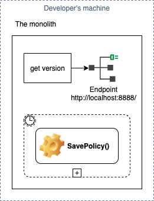
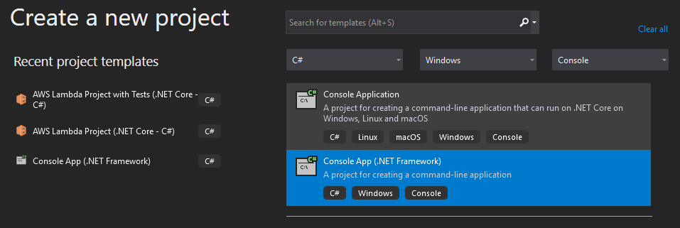
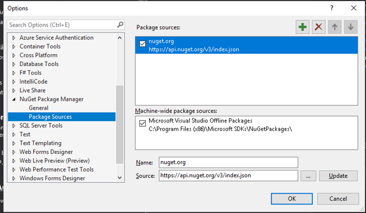
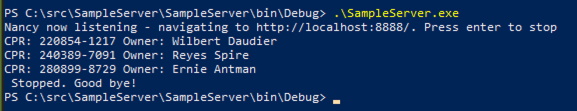

In this section we will build the initial .NET Framework based "monolith", which has a HTTP endpoint `http://localhost:8888` returning version of the program and a timer-triggered method `SavePolicy` which generates random insurance policies and "persists" them:



In VS2019 create a new _Console App (.NET Framework)_:



Choose _.NET Framework 4.7.2_ and name the project `SampleServer`.

Ensure your VS2019 has _nuget.org_ as a package source:



Then add following NuGet packages (you may need to add a new Package source to VS2019: ):

* Nancy

* Nancy.Hosting.Self

* RandomNameGeneratorLibrary

The add following code into the `Program.cs`:

```csharp
using System;
using System.Threading;

using Nancy;
using Nancy.Hosting.Self;
using RandomNameGeneratorLibrary;

namespace SampleServer
{

  public class VersionModule : NancyModule {
    public VersionModule() {
      Get("/", parameters => "Version 0.1");
    }
  }

  class Program {
    static PersonNameGenerator personGenerator = new PersonNameGenerator();
    static Random random = new Random();
    static void Main(string[] args) {
      using (var nancyHost = new NancyHost(new Uri("http://localhost:8888/"))) {
        nancyHost.Start();

        Console.WriteLine("Nancy now listening - navigating to http://localhost:8888/. Press enter to stop");

        var timer = new Timer(SavePolicy, null, 0, 3000);
        Console.ReadKey();
        timer.Dispose();
      }

      Console.WriteLine("Stopped. Good bye!");
    }

    private static void SavePolicy(object state) {
      var policy = new Policy {
        PolicyOwner = personGenerator.GenerateRandomFirstAndLastName(),
        CprNo = GenerateCprNo()
      };
      PersistPolicy(policy);
    }

    private static string GenerateCprNo() {
      var daysOld = random.Next(20 * 365, 100 * 365);
      var bday = DateTime.Today.AddDays(-daysOld);
      var seq = random.Next(1000, 9999);
      return bday.ToString("ddMMyy") + "-" + seq.ToString();
    }

    private static void PersistPolicy(Policy policy) {
      Console.WriteLine($"CPR: {policy.CprNo} Owner: {policy.PolicyOwner}");
    }
  }

  public class Policy {
    public string PolicyOwner { get; set; }
    public string CprNo { get; set; }
  }
}
```

Build the project.

Open the port `8888`:

```powershell
netsh http add urlacl url="http://+:8888/" user="Everyone"
```

Then run the `./bin/Debug/SampleServer.exe` and you should see output similar to following:



Open `http://localhost:8888/` in the browser, you should see `Version 0.1`.

We got our .NET Framework-based "monolith" working. We want to make the `Policy` data processed by the "monolith" available for a Cloud-based micro-service. So let's move on to building the micro-service.


