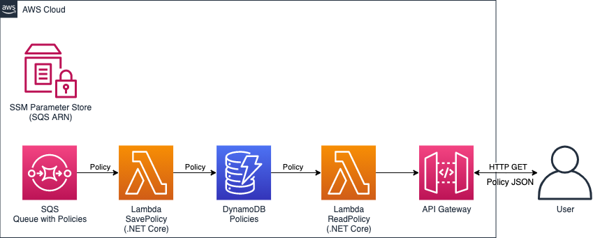
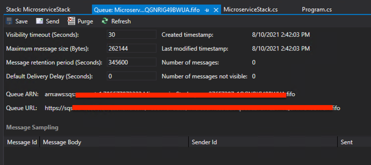

We will build a microservice with the following architecture:



We will use following AWS services: SQS, Lambda, DynamoDB, API Gateway and AWS Systems Manager (SSM), therefore we need to add respective CDK packages into the `Microservice` project. You can do it in CLI with `dotnet` command:

```powershell
cd src
dotnet add Microservice package Amazon.CDK.AWS.SQS
dotnet add Microservice package Amazon.CDK.AWS.Lambda
dotnet add Microservice package Amazon.CDK.AWS.Lambda.EventSources
dotnet add Microservice package Amazon.CDK.AWS.DynamoDB
dotnet add Microservice package Amazon.CDK.AWS.APIGateway
dotnet add Microservice package Amazon.CDK.AWS.SSM
```

or in VS2019 UI: right-click on the project `Microservice`, then `Manage NuGet Packages..` and pick the packages listed above.

Rebuild the project to ensure everything is OK.

Open file `MicroserviceStack.cs` and add the necessary `using`s:

```csharp
using Amazon.CDK;
using Amazon.CDK.AWS.SQS;
using Amazon.CDK.AWS.Lambda;
using Amazon.CDK.AWS.Lambda.EventSources;
using Amazon.CDK.AWS.APIGateway;
using Amazon.CDK.AWS.DynamoDB;
using Amazon.CDK.AWS.SSM;
```

Declare SSM parameter name where we will store SQS queue URL as a constant in the class `MicroserviceStack`:

```csharp
const string QUEUE_SSM_PARAMETER_NAME = "/monolith/policyQueueUrl";
```

Let us instantiate SQS queue in the `MicroserviceStack` constructor:

```csharp
var queue = new Queue(this, "queue", new  QueueProps {
    Fifo = true
});
```

To ensure the messages arrive in order we set the `Fifo` parameter to `true`.

Next let us define the SSM Parameter which will store the SQS URL. Our "monolith" will then read the SSM Parameter to access the queue:

```csharp
var ssmParam = new StringParameter(this, "policyQueueUrl", new StringParameterProps {
    ParameterName = QUEUE_SSM_PARAMETER_NAME,
    Description = "URL of the queue with policies",
    StringValue = queue.QueueUrl
});
```

To print the SQS URL add following line in the end of the constructor:

```csharp
new CfnOutput(this, "Queue", new CfnOutputProps() { Value = queue.QueueUrl });
```

Build the `Microservice` project.

You can see what CloudFormation is generated by CDK by executing following command in  `microservice` directory:

```powershell
cdk synth
```

You can also see what resources will be deployed in AWS:

```powershell
cdk diff
```

You should see output resembling following:

```text
Resources
[+] AWS::SQS::Queue queue queue276F7297
[+] AWS::SSM::Parameter policyQueueUrl policyQueueUrlC537C889

Outputs
[+] Output Queue Queue: {"Value":{"Ref":"queue276F7297"}}
```

Now you can deploy the stack (resources):

```powershell
cdk deploy
```

You should see output similar to this:

```text
MicroserviceStack: deploying...
MicroserviceStack: creating CloudFormation changeset...
  0/4 |2:41:53 PM | REVIEW_IN_PROGRESS   | AWS::CloudFormation::Stack | MicroserviceStack User Initiated
  0/4 |2:41:58 PM | CREATE_IN_PROGRESS   | AWS::CloudFormation::Stack | MicroserviceStack User Initiated
  0/4 |2:42:03 PM | CREATE_IN_PROGRESS   | AWS::CDK::Metadata  | CDKMetadata/Default (CDKMetadata)
  0/4 |2:42:03 PM | CREATE_IN_PROGRESS   | AWS::SQS::Queue     | queue (queue276F7297)
  0/4 |2:42:03 PM | CREATE_IN_PROGRESS   | AWS::SQS::Queue     | queue (queue276F7297) Resource creation Initiated
  0/4 |2:42:04 PM | CREATE_IN_PROGRESS   | AWS::CDK::Metadata  | CDKMetadata/Default (CDKMetadata) Resource creation Initiated
  1/4 |2:42:05 PM | CREATE_COMPLETE      | AWS::CDK::Metadata  | CDKMetadata/Default (CDKMetadata)
  2/4 |2:42:05 PM | CREATE_COMPLETE      | AWS::SQS::Queue     | queue (queue276F7297)
  2/4 |2:42:06 PM | CREATE_IN_PROGRESS   | AWS::SSM::Parameter | policyQueueUrl (policyQueueUrlC537C889)
  2/4 |2:42:08 PM | CREATE_IN_PROGRESS   | AWS::SSM::Parameter | policyQueueUrl (policyQueueUrlC537C889) Resource creation Initiated
  3/4 |2:42:09 PM | CREATE_COMPLETE      | AWS::SSM::Parameter | policyQueueUrl (policyQueueUrlC537C889)
  4/4 |2:42:11 PM | CREATE_COMPLETE      | AWS::CloudFormation::Stack | MicroserviceStack

 ✅  MicroserviceStack

Outputs:
MicroserviceStack.Queue = https://sqs.......fifo

Stack ARN:
arn:...
```

Congratulation! You have just deployed your first AWS resources with IaC implemented CDK/.NET without leaving Visual Studio and PowerShell. Neat, isn't?

Now you can check your SQS queue in _AWS Explorer_ (Ctrl+K, A): click first on the _Refresh_ icon and then expand the `Amazon SQS` node, double-click on the queue element and open its details sheet:



You can also expand the _AWS CloudFormation_ node and check `MicroserviceStack` deployed by your CDK-derived `MicroserviceStack` class. Double-click on the stack element and explore tabs _Events_, _Resources_, _Template_, _Outputs_.

You are also welcome check your newly created resources in AWS Console.

