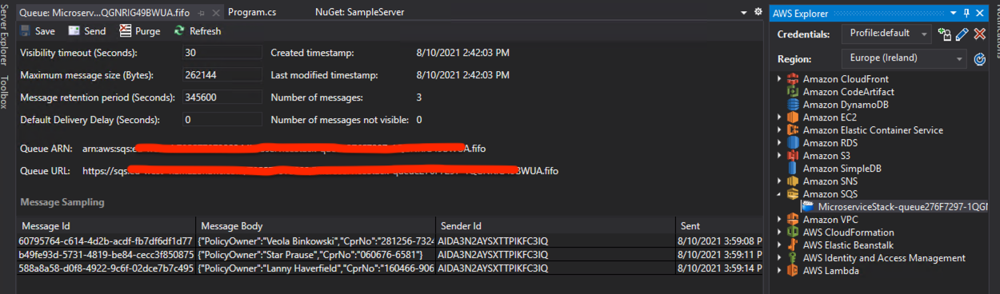

Let's make our legacy "monolith" Cloud-aware and make it sending the insurance policies to the SQS queue.

The "monolith" reads the SQS URL from the SSM parameter, connects to the queue, and send the insurance policies into the queue.

Open the `SampleServer` project in another VS2019 and add following NuGet packages to the project:

* Newtonsoft.Json

* AWSSDK.SQS

* AWSSDK.SimpleSystemsManagement

Then paste following code into the `Program.cs`:

```csharp
using System;
using System.Threading;

using Amazon.SQS;
using Amazon.SQS.Model;
using Amazon.SimpleSystemsManagement;
using Amazon.SimpleSystemsManagement.Model;
using Nancy;
using Nancy.Hosting.Self;
using Newtonsoft.Json;
using RandomNameGeneratorLibrary;

namespace SampleServer
{

    public class VersionModule : NancyModule
    {
        public VersionModule()
        {
            Get("/", parameters => "Version 0.2");
        }
    }
    class Program
    {
        const string QUEUE_SSM_PARAMETER_NAME = "/monolith/policyQueueUrl";
        static PersonNameGenerator personGenerator = new PersonNameGenerator();
        static Random random = new Random();
        static string queueUrl;
        static AmazonSQSClient queue;

        static void Main(string[] args)
        {
            var queueUrlParam = new AmazonSimpleSystemsManagementClient()
                .GetParameter(new GetParameterRequest {
                    Name = QUEUE_SSM_PARAMETER_NAME
                });
            queueUrl = queueUrlParam.Parameter.Value;
            Console.WriteLine($"Using queue URL: {queueUrlParam.Parameter.Value}");
            queue = new AmazonSQSClient();

            using (var nancyHost = new NancyHost(new Uri("http://localhost:8888/")))
            {
                nancyHost.Start();

                Console.WriteLine("Nancy now listening - navigating to http://localhost:8888/. Press enter to stop");

                var timer = new Timer(savePolicy, null, 0, 3000);
                Console.ReadKey();
                timer.Dispose();
            }

            Console.WriteLine("Stopped. Good bye!");
        }

        private static void savePolicy(object state)
        {
            var policy = new Policy {
                PolicyOwner = personGenerator.GenerateRandomFirstAndLastName(),
                CprNo = GenerateCprNo()
            };
            SendMessage(policy);
        }

        private static string GenerateCprNo()
        {
            var daysOld = random.Next(20 * 365, 100 * 365);
            var bday = DateTime.Today.AddDays(-daysOld);
            var seq = random.Next(1000, 9999);
            return bday.ToString("ddMMyy") + "-" + seq.ToString();
        }

        private static void SendMessage(Policy policy)
        {
            var body = JsonConvert.SerializeObject(policy);
            var resp = queue.SendMessage(new SendMessageRequest {
                QueueUrl = queueUrl,
                MessageGroupId = "policies",
                MessageDeduplicationId = policy.CprNo,
                MessageBody = body
            });
            Console.WriteLine($"Sent {body}, status: {resp.HttpStatusCode}");
        }
    }

    public class Policy {
        public string PolicyOwner { get; set; }
        public string CprNo { get; set; }
    }
}
```

The key parts of the code are:

* the beginning of `Main()` where we initialize the `queueUrl` and `queue`;

* the method `SendMessage()` which sends the insurance policy as JSON object into the queue. Pay attention to the properties `MessageDeduplicationId` and `MessageGroupId` which are necessary for FIFO queues.

Now it's time to run the "monolith" and see if it sends the policies into the queue:

```powershell
.\bin\Debug\SampleServer.exe
```

You should get output similar to:

```text
Using queue URL: https://sqs.....fifo
Nancy now listening - navigating to http://localhost:8888/. Press enter to stop
Sent {"PolicyOwner":"Veola Binkowski","CprNo":"281256-7324"}, status: OK
Sent {"PolicyOwner":"Star Prause","CprNo":"060676-6581"}, status: OK
Sent {"PolicyOwner":"Lanny Haverfield","CprNo":"160466-9067"}, status: OK
Stopped. Good bye!
```

Stop the execution after you get a couple of entries on the screen, and go to _AWS Explorer_ (Ctrl+K, A) extension and check the messages in the SQS queue. You should see something similar to:



You may need to click on the _Refresh_ button to get the screen updated with the recent messages.

Congratulations! Now we are done with the "monolith" and are getting the necessary data into Cloud. Time to finalize our microservice and add the Lambdas, DynamoDB and API Gateway.
