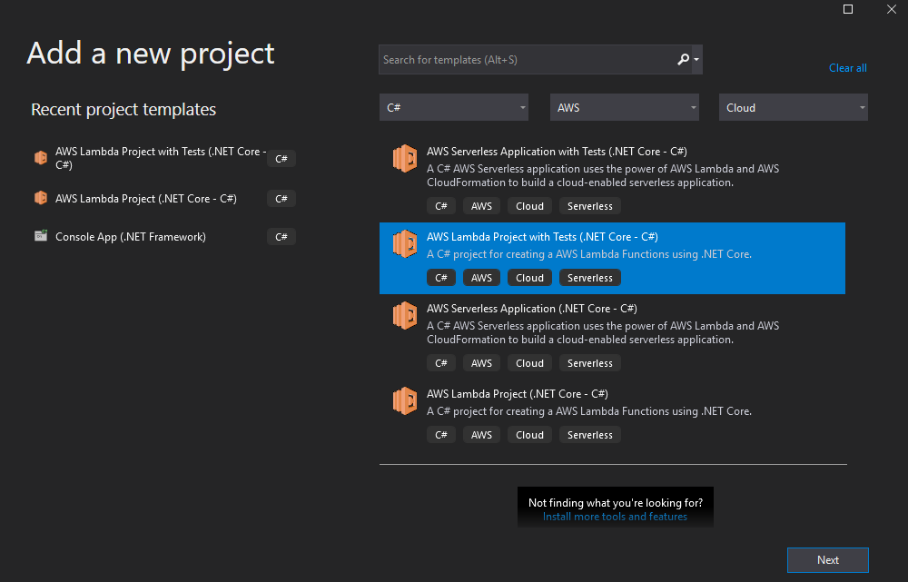
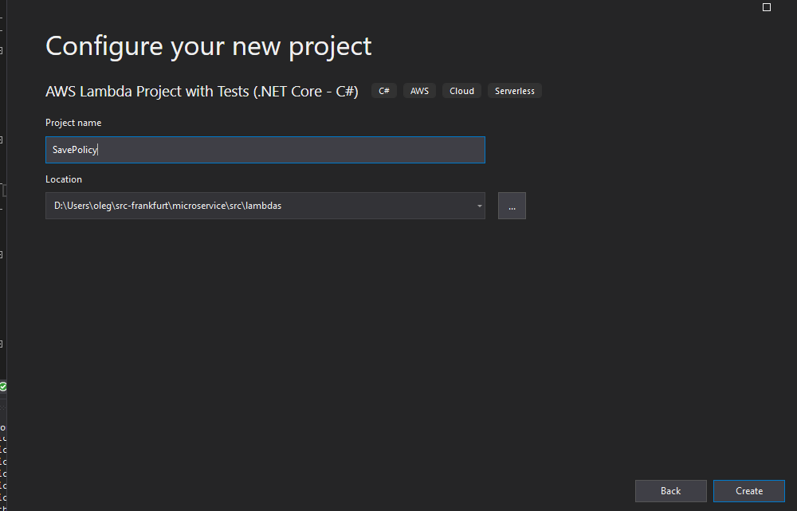
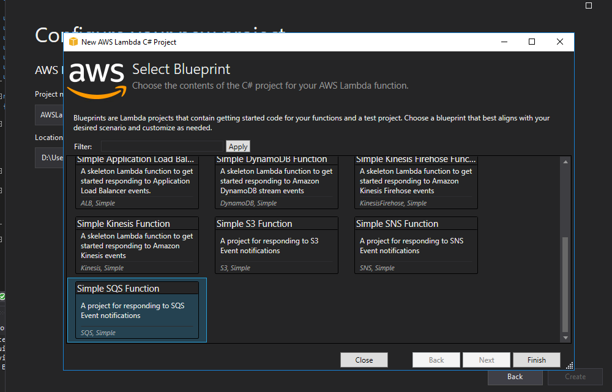

In this section we will create a `SavePolicy` Lambda which will read the insurance policies from the SQS queue and will save them in a DynamoDB table.

Open VS2019 with the `Microservice` solution.

Add a new Lambda project `SavePolicy` as described in <https://docs.aws.amazon.com/toolkit-for-visual-studio/latest/user-guide/lambda-creating-project-in-visual-studio.html> into the `Microservice` solution. Use the template _AWS Lambda Project with Tests (.NET Core - C#)_ and _SQS_ blueprint in `<path>\src\lambdas`.



Project name and path:



Select the SQS blueprint:



Add the `AWSSDK.DynamoDBv2` NuGet package as a dependency to the `SavePolicy` project.

Build the whole `Microservice` solution and ensure there are no errors.

Open the `Function.cs` in `SavePolicy` project, and paste following code into the file:

```csharp
using System;
using System.Threading.Tasks;
using System.Text.Json;

using Amazon.DynamoDBv2;
using Amazon.DynamoDBv2.DocumentModel;
using Amazon.Lambda.Core;
using Amazon.Lambda.SQSEvents;

// Assembly attribute to enable the Lambda function's JSON input to be converted into a .NET class.
[assembly: LambdaSerializer(typeof(Amazon.Lambda.Serialization.SystemTextJson.DefaultLambdaJsonSerializer))]

namespace SavePolicy
{
  public class Function
  {
    private const string TABLE = "TABLE";
    internal static AmazonDynamoDBClient client = new AmazonDynamoDBClient();
    internal static Table table = Table.LoadTable(client, Environment.GetEnvironmentVariable(TABLE));

    /// <summary>
    /// Default constructor. This constructor is used by Lambda to construct the instance. When invoked in a Lambda environment
    /// the AWS credentials will come from the IAM role associated with the function and the AWS region will be set to the
    /// region the Lambda function is executed in.
    /// </summary>
    public Function()
    {

    }


    /// <summary>
    /// This method is called for every Lambda invocation. This method takes in an SQS event object and can be used 
    /// to respond to SQS messages.
    /// </summary>
    /// <param name="evnt"></param>
    /// <param name="context"></param>
    /// <returns></returns>
    public async Task FunctionHandler(SQSEvent evnt, ILambdaContext context)
    {
      foreach (var message in evnt.Records)
      {
        await ProcessMessageAsync(message, context);
      }
    }

    private async Task ProcessMessageAsync(SQSEvent.SQSMessage message, ILambdaContext context)
    {
      context.Logger.LogLine($"Processed message {message.Body}");

      try
      {
        var policy = JsonSerializer.Deserialize<Policy>(message.Body);
        await table.PutItemAsync(new Document {
                    { "CprNo", policy.CprNo },
                    { "PolicyOwner", policy.PolicyOwner }
                });
      }
      catch (Exception e)
      {
        context.Logger.LogLine($"ERROR: {e.Message}");
      }
      await Task.CompletedTask;
    }
  }

  public class Policy
  {
    public string CprNo { get; set; }
    public string PolicyOwner { get; set; }
  }
}
```

Build the project and ensure there are no errors.

Now you can connect the dots between the CDK code in `MicroserviceStack.cs` and the key section in the Lambda code:

* the name of DynamoDB `table` is taken from the environment variable `TABLE` which is provisioned in the `Environment` dictionary of `savePolicy` in `MicroserviceStack.cs`.

* every SQS message is processed in the method `ProcessMessageAsync()`: the message is deserialized into `Policy` object and then saved into the DynamoDB `table`.

* you can see the Lambda handler `SavePolicy::SavePolicy.Function::FunctionHandler` if you right-click on the project _SavePolicy -> Publish to AWS Lambda..._ - look into the bottom of the dialog there is a field `Handler`. The value was used in the `savePolicy.Handler` property in `MicroserviceStack.cs`.  Don't publish the Lambda - we will do it using CDK later.
