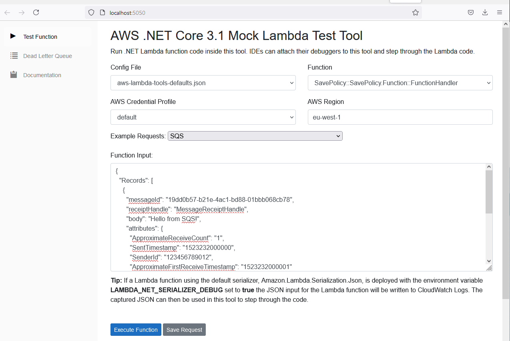
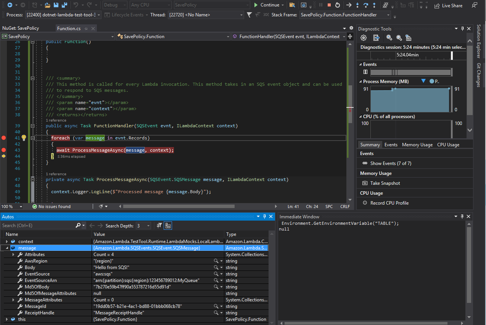

It's possible to debug Lambdas on the local machine.

Set the `SavePolicy` as a Start-up project.

Set breakpoint on `foreach` in the method `FunctionHandler()`.

Press _F5_ to start the debugger - you will see a browser opening with a _AWS .NET Core 3.1 Mock Lambda Test Tool_. Set `SQS` in _Example Requests_  and press _Execute Function_:



The debugger will stop at the line and you can inspect content of the `message`, containing `Body = "Hello from SDS!"`:



We can stop the debugger here. To debug the function for real the _"Hello from SDS!"_ message needs to be replaced with a JSON object representing `Policy` object and we need to provide the DynamoDB table name in the environment variable `TABLE` in the file `aws-lambda-tools-defaults.json` in the project `SavePolicy`:

```json
"environment-variables": "\"TABLE\"=\"<table-reference>\";"
```

We will know the DynamoDB table name after we deploy the whole stack.

I will leave the full debugging session as a separate exercise for a motivated participant :)

Set the `Microservice` project again as start-up project in the solution.
