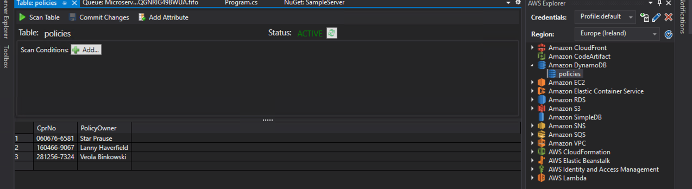
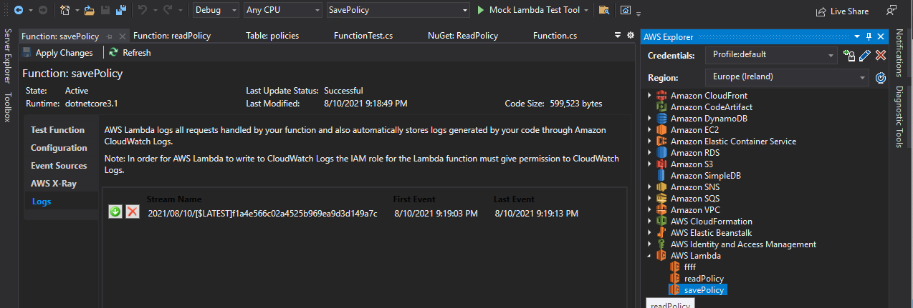

Now we have all the bits and pieces: IaC code and business logic in Lambdas.

Time to deploy the whole thing and see how it works!

Switch to the PowerShell with the `microservice` CDK project and do:

```powershell
cdk deploy
```

In the result you should get error-free output ending with something resembling this:

```text
...

 ✅  MicroserviceStack

Outputs:
MicroserviceStack.Api = <api-url>
MicroserviceStack.PoliciesAPIEndpoint0E6576D6 = <api-url>
MicroserviceStack.Queue = <sqs-url>

Stack ARN:
<stack-arn>
```

After this you can go into _AWS Explorer_ (Ctrl+K, A) and inspect the contents of the `policies` table:



You will see entries which were previously generated by the "monolith" and now they are processed by the newly deployed `SavePolicy` Lambda and saved in the table.

Take the `<api-url>` reported above and test the microservice endpoint using of the CPR numbers noted above (use `curl` or browser):

```powershell
curl https://<api-url>policies/<cprno>
```

e.g.:

```powershell
curl https://my-url.com/prod/policies/060676-6581
```

You will get output similar to:

```json
{"CprNo":"060676-6581","PolicyOwner":"Star Prause"}
```

Success! Congratulations with the completion of end-to-end development of a .NET-based microservice without leaving Visual Studio and PowerShell.

You can also start the monolith in a separate PowerShell and let it send some new policies to the cloud, and then query them via the API endpoint.

As an additional exercise you can inspect Lambda logs: go to  _AWS Explorer_ (Ctrl+K, A), expand _AWS Lambda_ and double-click on `savePolicy`, then go to _Logs_ and click on the green "download" button close to one of the log entries:



You will get a Notepad with logs similar to:

```text
2021-08-10 21:19:03: START RequestId: b8006252-2f24-58c3-b0cb-3bdefc43fa81 Version: $LATEST
2021-08-10 21:19:03: Processed message {"PolicyOwner":"Veola Binkowski","CprNo":"281256-7324"}
2021-08-10 21:19:12: Processed message {"PolicyOwner":"Star Prause","CprNo":"060676-6581"}
2021-08-10 21:19:13: Processed message {"PolicyOwner":"Lanny Haverfield","CprNo":"160466-9067"}
2021-08-10 21:19:13: END RequestId: b8006252-2f24-58c3-b0cb-3bdefc43fa81
2021-08-10 21:19:13: REPORT RequestId: b8006252-2f24-58c3-b0cb-3bdefc43fa81	Duration: 9666.80 ms	Billed Duration: 9667 ms	Memory Size: 128 MB	Max Memory Used: 98 MB	Init Duration: 186.37 ms	
```
