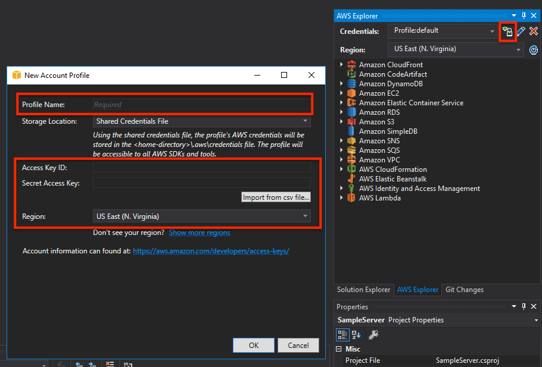

- If you don't have Visual Studio 2019, then download [VS 2019 Community](https://visualstudio.microsoft.com/vs/community/).

- In case you are installing VS2019 Community, select following modules (or ensure the modules are provisioned in the existing installation):

  - ASP.NET and web development;

  - .NET Desktop Development;

  - .NET cross-platform development.

- Setup a IAM user which you will use in the workshop:

  - In the AWS Console go to _IAM > Users > Add Users_

  - Set _User name_ to `dev` and check _Programmatic access_, click _Next.._

  - In the _Set permissions_ click _Attach existing policies directly_

  - In the field _Filter policies_ type `Admin` and pick the `AdministratorAccess` policy. Click _Next.._.

  - Kee the tags empty. Click _Next.._.

  - Click _Create user_.

  - Click the _Download .csv_ to save the user credentials locally. Save the CSV file.

- Install [AWS Toolkit for Visual Studio 2017 and 2019](https://marketplace.visualstudio.com/items?itemName=AmazonWebServices.AWSToolkitforVisualStudio2017), then:

  - Go to _View -> AWS Explorer (Ctrl+K, A)_;

  - Click on the `+` icon and add a new profile: set the _Profile name_ to `default`, and enter the AWS credentials from the CSV file you have downloaded earlier (use the 3rd and 4th fields: _Access key ID_ and _Secret access key_ respectively).

  

  - Click _OK_ and the extension should successfully connect to to AWS, so you will see a list of AWS services as it's shown on the picture above.
